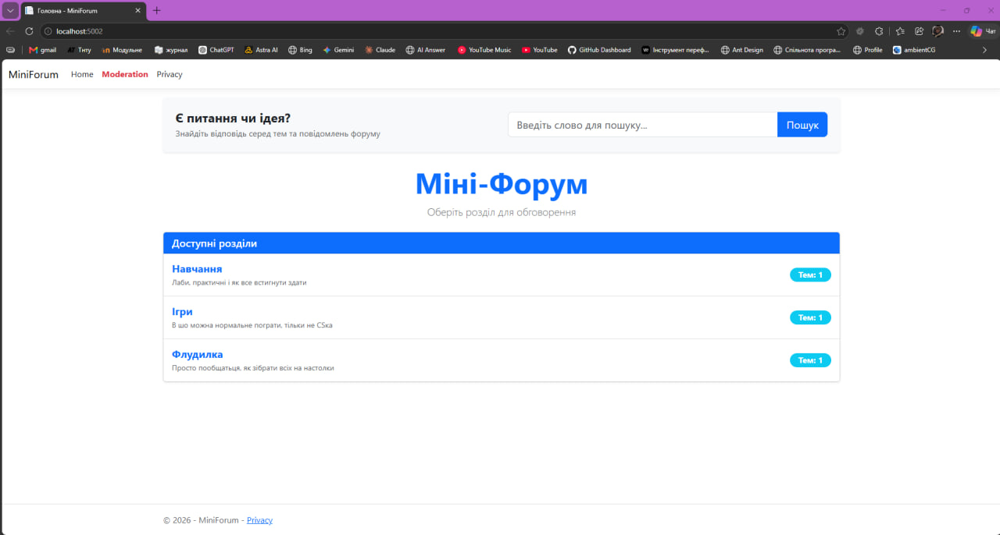
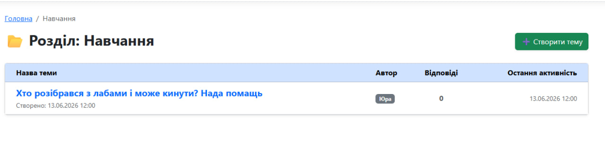
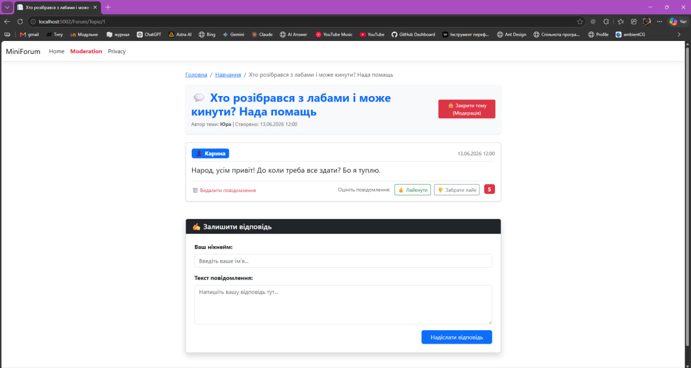
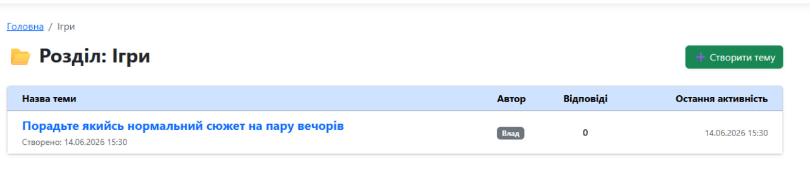
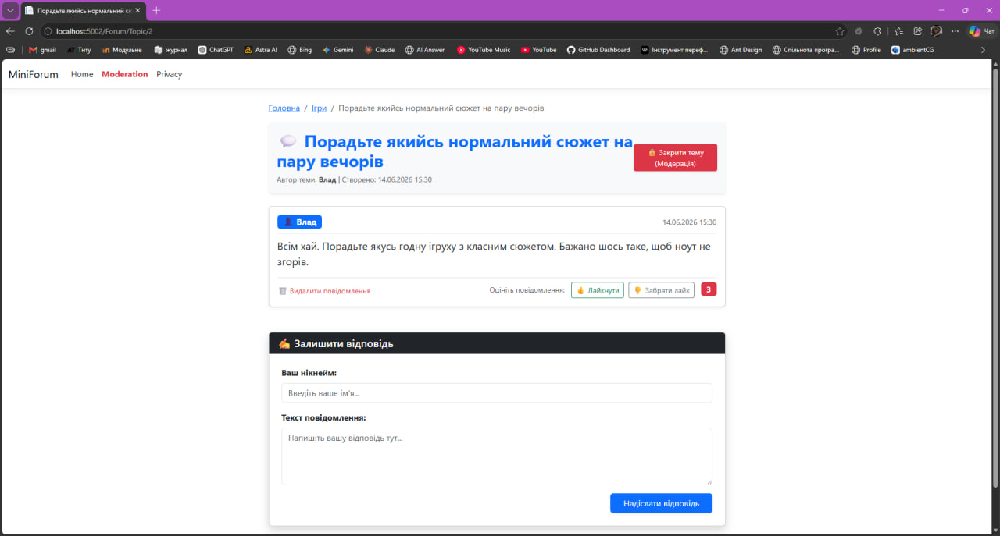
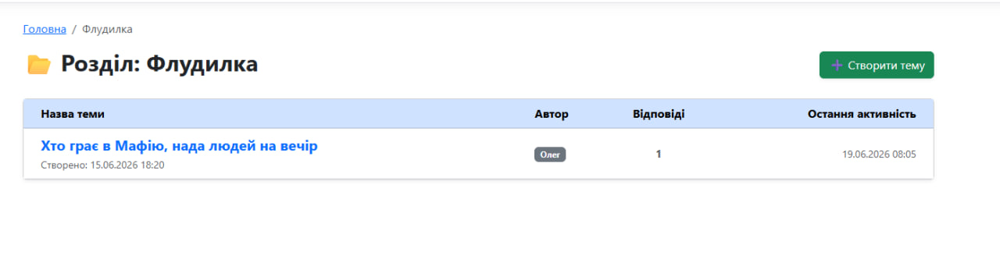
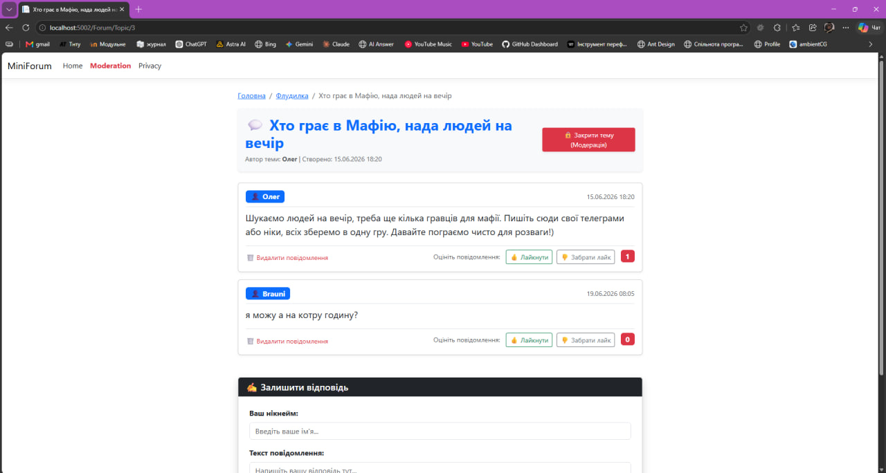
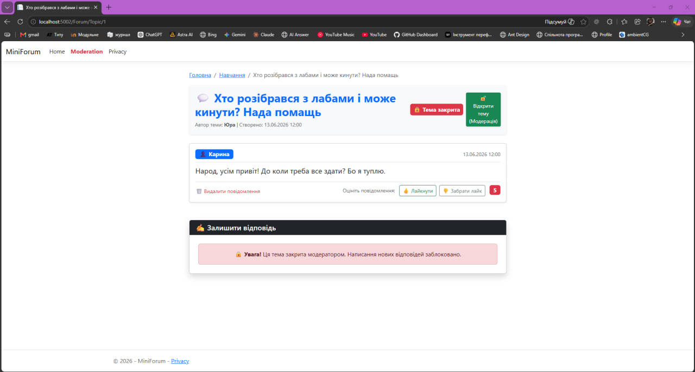

# 🌐 Вебплатформа «MiniForum»

Привіт! Це мій проєкт міні-форуму, який я розробила в межах навчальної практики з комп'ютерного програмування. Застосунок створений для того, щоб студенти могли швидко обмінюватися інформацією, створювати теми для обговорення та коментувати пости один одного.

---

## 🛠️ На чому написаний проєкт (Стек)
* **Фреймворк:** ASP.NET Core 8 MVC
* **База даних:** SQLite
* **Робота з БД:** Entity Framework Core (підхід Code First)
* **Автоматичне розгортання:** База даних створюється сама за допомогою `Database.EnsureCreated()`, тому при першому запуску файл `forum.db` генерується автоматично і одразу наповнюється тестовими розділами й темами.
* **Фронтенд:** HTML5, CSS3, Bootstrap 5 для адаптивного дизайну та чистий JavaScript (Fetch API) для лайків без перезавантаження сторінки.

---

## 🚀 Що реалізовано в проєкті

### 👤 Модуль для звичайних користувачів
1. **Головна сторінка:** виводит список усіх розділів форуму («Навчання», «Ігри», «Флудилка»). Кількість тем у кожному розділі рахується автоматично через LINQ-запит.
2. **Стрічка тем:** всередині розділу можна побачити список тем із зазначенням автора, дати створення та кількості відповідей. Теми автоматично сортуються так, щоб угорі завжди були ті, де була остання активність.
3. **Створення топіків:** працює форма додавання нової теми — потрібно ввести назву, текст першого повідомлення та своє ім'я.
4. **Обговорення:** можна зайти в будь-яку тему, прочитати всі повідомлення по порядку та залишити свій коментар.
5. **Пошук:** на сайті є пошуковий рядок, який шукає збіги одночасно і в назвах тем, і в самих текстах повідомлень.
6. **Лайки:** до кожного коментаря додано лічильник «подобається». Завдяки AJAX/Fetch API лайк ставиться миттєво без оновлення всієї сторінки сайту.

### 👑 Модуль для модератора
1. **Керування розділами (CRUD):** модератор може створювати нові категорії форуму, редагувати їх або видаляти.
2. **Модерація тем:** є можливість закрити тему для обговорення. Після цього звичайні користувачі бачать попередження і більше не можуть залишати там відповіді.
3. **Очищення спаму:** модератор може безповоротно видаляти будь-які некоректні повідомлення.

---

## 📸 Скріншоти та демонстрація роботи

### 1. Головна сторінка форуму
Тут відображаються всі створені розділи сайту із динамічним підрахунком кількості тем, загальна стрічка, а також інтегровано пошуковий рядок.

---

### 2. Розділ «Навчання» та обговорення лаб
* Список тем у розділі:

* Перегляд теми Юри про лабораторні роботи (модуль коментарів та робота лічильника лайків):

---

### 3. Розділ «Ігри» та вибір сюжету на вечір
* Список тем у розділі:

* Обговорення гри з класним сюжетом у темі Влада:

---

### 4. Розділ «Флудилка» та збори на Мафію
* Список тем у розділі:

* Перегляд теми Олега про пошук людей на гру в Мафію:

---

### 5. Робота модератора: закриття теми та валідація
На скріншоті показано інтерфейс після того, як модератор закрив обговорення (з'явився статус «Тема закрита» та зелена кнопка для її відкриття). 

Для звичайних користувачів автоматично спрацьовує валідація — замість форми додавання коментаря відображається інформаційне вікно: *«Увага! Ця тема закрита модератором. Написання нових відповідей заблоковано»*. Це повністю виключає можливість надсилання нових повідомлень у закриті топіки.

